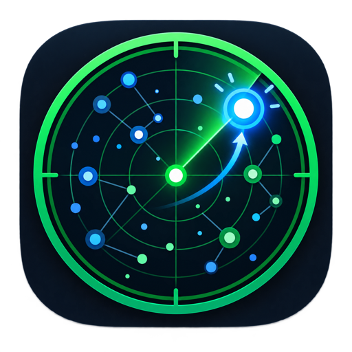

<p align="center">
  
</p>

<h1 align="center">GitHub Radar</h1>

<p align="center">
  一个只读的 Codex 插件：每天发现 GitHub 新项目，并用本地快照识别真正加速增长的项目。
</p>

<p align="center">
  <a href="https://github.com/w93139/github-radar/actions/workflows/test.yml"></a>
  
  
  
</p>

## 它会给你什么

每天生成一份中文 Markdown 报告：

- 近 7 天新建项目 Top 10：公开、非 Fork、未归档，按 Star、日均 Star 与更新时间排序。
- 过去 24 小时增长 Top 10：聚合 GitHub Daily/Weekly Trending、近期新项目和本地追踪候选。
- 每个入榜项目读取公开 README，提取一句话介绍；无法提取时回退到 GitHub 仓库简介。
- Codex 插件会为没有中文的介绍保留原文，并在同一单元格附上中文翻译；命令行原始输出保留 README 原语言。
- 3 个重点项目摘要、数据时间、来源和完整性警告。
- 支持按语言、GitHub Topic、新项目窗口和增长窗口筛选。

增长榜明确是“候选范围内增速榜”，不会冒充覆盖整个 GitHub。首次运行没有本地基线时，会把 GitHub Trending 的 `stars today` 标记为回退口径；积累约 24 小时快照后，优先显示本地实测 Star 增量。

## 插件呈现方式

安装后，GitHub Radar 会出现在 Codex 的插件列表中，带有独立图标、说明和快捷提示词。你可以直接说：

- `使用 $github-radar 生成今天榜单`
- `使用 $github-radar 只看 Rust`
- `使用 $github-radar 只看 AI Agent 项目`
- `使用 $github-radar 查看近 7 日增长`

报告显示在 Codex 任务中；定时任务可以每天自动运行并把报告发布到指定任务。

### 已安装用户最快用法

1. 在 Codex 中新建一个任务，让新任务加载最新插件。
2. 输入：`使用 $github-radar 生成今天榜单`。
3. 像素雷达机器人会在对话中返回两张宽版表格：新项目 Top 10 和候选范围内增速 Top 10；介绍列优先占据展示空间。

它不是独立桌面 App，也不会打开单独的网页仪表盘；当前 UI 就是 Codex 插件卡片、快捷提示词和对话里的 Markdown 榜单。

## 安装

需要 macOS 或 Linux、Python 3.10+，以及已经安装并登录的 [GitHub CLI](https://cli.github.com/)：

```bash
gh auth status
codex plugin marketplace add w93139/github-radar
codex plugin add github-radar@github-radar
```

安装后请新建一个 Codex 任务，以加载插件技能。

更新插件：

```bash
codex plugin marketplace upgrade github-radar
codex plugin add github-radar@github-radar
```

## 命令行使用

插件内部使用一个只依赖 Python 标准库和现有 `gh` 登录的采集器：

```bash
python3 scripts/github_radar.py
python3 scripts/github_radar.py --language Rust
python3 scripts/github_radar.py --topic ai-agent --growth-hours 168
python3 scripts/github_radar.py --format json
```

完整参数：

```text
--limit 10
--language all|<language>
--topic <topic>
--new-window-days 7
--growth-hours 24
--timezone Asia/Shanghai
--format markdown|json
--state-dir <path>
```

JSON 输出固定包含 `generated_at`、`scope`、`new_projects`、`fast_growth`、`highlights`、`warnings` 和 `data_sources`。

## 数据与隐私

- 只读取公开 GitHub 仓库数据，不读取私有仓库或组织内部信息。
- REST 只允许 `GET /search/repositories` 与 `GET /repos/{owner}/{repo}`；GraphQL 只允许内部构造的 `query`，显式拒绝 `mutation`。
- 不查看、不复制、不导出、不持久化访问令牌；GitHub 登录由 `gh` 负责。
- 历史快照保存在 `~/.local/share/github-radar/radar.sqlite3`，默认保留 90 天。
- 数据库写入使用事务；失败运行不会覆盖最近一次有效基线。
- API 限流或 Trending 失效时输出可用的部分结果，不伪造增长数据。

详见 [SECURITY.md](SECURITY.md)。

## 自动化建议

在 Codex 桌面应用中创建每日 09:00（`Asia/Shanghai`）的定时任务，提示词可直接调用：

```text
运行 GitHub Radar 已验证的采集脚本，生成今天的中文新项目 Top 10 与候选范围内增速 Top 10；保留所有数据警告和来源说明。
```

本地定时任务需要电脑开机且 Codex 桌面应用正在运行。

## 开发与验证

```bash
python3 -m py_compile scripts/github_radar.py
python3 -m unittest discover -s scripts/tests -v
```

测试覆盖 Search JSON 与 Trending HTML 解析、去重和过滤、首次基线、24 小时增量、API 部分失败、数据库损坏以及只读端点约束。GitHub Actions 会在每次提交和 Pull Request 上重复这些检查。

## License

[MIT](LICENSE)

---

**English:** GitHub Radar is a read-only Codex plugin that ranks newly created public repositories and measures Star growth from local snapshots. It uses only Python's standard library and an existing authenticated GitHub CLI session.
